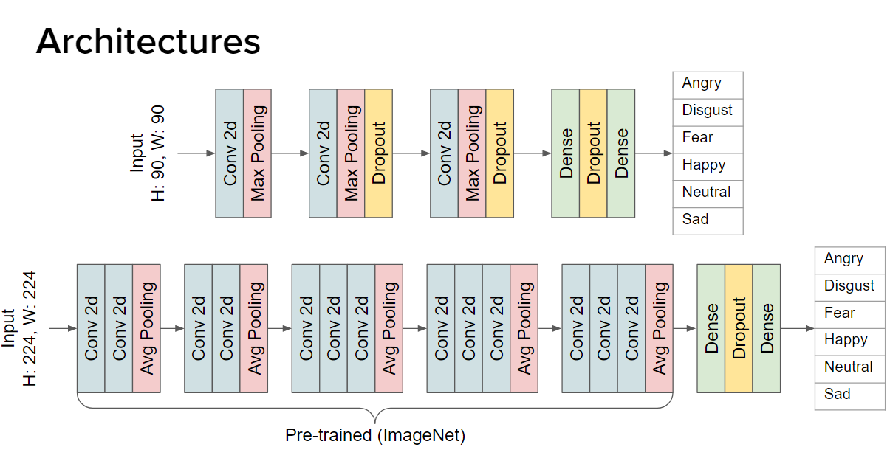

# Emotion Detection for Webcam and Screencast
This project is based on the FER2013 dataset and is an implementation to try and detect different facial emotions using a Tensorflow implementation. Our primary usecase was to try and detect the faces of online meetings so that presenters can guage the audience reactions and get a live general sentiment on their audience.

This project was made possible with the contributions of the following people:
https://github.com/cweien3008<br>
https://github.com/InitialCnotD<br>
https://github.com/Jamessukanto<br>
https://github.com/Thiggz<br>
https://github.com/ytan101

FER2013 (https://www.kaggle.com/datasets/msambare/fer2013) consists of 7 classes (angry, disgust, fear, happy, neutral, sad, surprise)

In order to scope down the project to either positive, neutral or negative emotions, surprise was not considered.
```
git clone https://github.com/ytan101/workplace-emotion-detector.git
pip install -r requirements.txt
```
## Webcam Emotion Detection
<br>
This implementation is done with Streamlit serving as the webapp.
- Navigate to src/webcam_feed
- Run the Streamlit command below
```
streamlit run app.py
```
## Screencast Emotion Detection

To run:
```
python -m src.screencast.screen_capture
```
Press esc when done to quit the window
## Using Pre-trained Models
- Create an empty folder in `src` called `models` and load your pre-trained Tensorflow models or download one from the below links. 
- Masked Model https://drive.google.com/file/d/1n6SkWrHVIwlFYQttX2OIEpRS8CXkQ_3U/view?usp=sharing
- Unmasked Model - https://drive.google.com/file/d/1bWqLDHw3e_oQYvzaY4MLQhWAYjdUynZQ/view?usp=sharing
- The path will be `src\models\MODEL_NAME` once created. (Change `MODEL_NAME` to something appropriate)
## Training your own dataset
- We have 2 model architectures which you may use to train your own weights or freely modify

- The first architecture is a simple CNN which achieves an accuracy of ~60%
- The second architecture uses transfer learning with VGG-16 which also achieved an accuracy of ~60%
- You may access the models at `src/model_architectures` to perform training on your custom dataset.
- Place your dataset in `src/data` and ensure it has train and validation folders with subfolders for each dataclass as we are using Tensorflow's `flow_from_directory` API.
## Constants
- There is a `constants.py` file within the `src` folder which can be freely modified.
- `src/haar_cascades` contains different Haar cascades used for face detection. You may choose to add your own Haar cascade .xml file and point to it accordingly.
